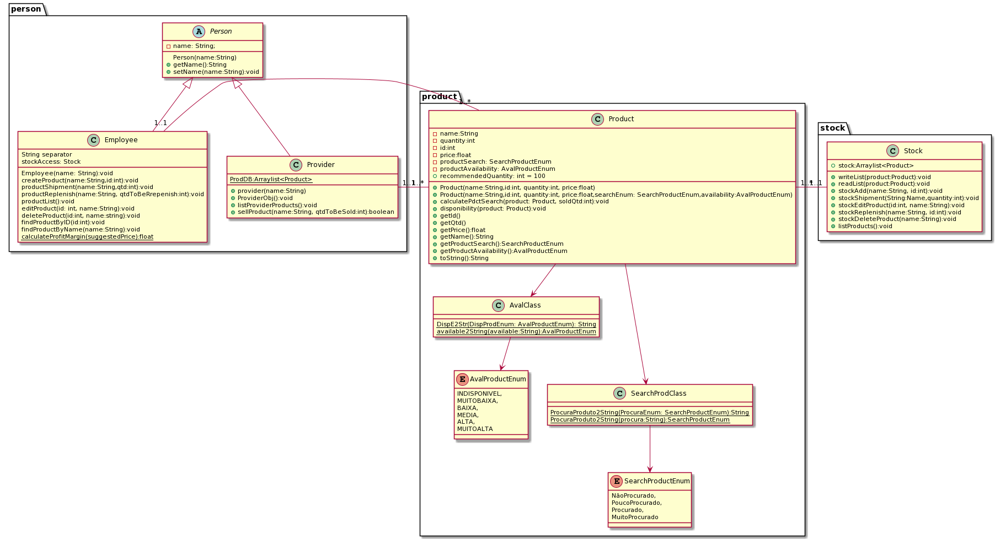

## Getting Started

This is a project for our subject of Oriented Object Programming at UFC, which consists in create a Stock Control System for a mechanical workshop, where the main things the employee can do is to create a product at the stock, edit a product at the stock, list all the products available and their quantity and remove the item from the stock.  

## Folder Structure

The workspace contains two folders by default, where:

- `src`: the folder to maintain sources
- `lib`: the folder to maintain dependencies

Meanwhile, the compiled output files will be generated in the `bin` folder by default.

> If you want to customize the folder structure, open `.vscode/settings.json` and update the related settings there.

## Diagrama UML
